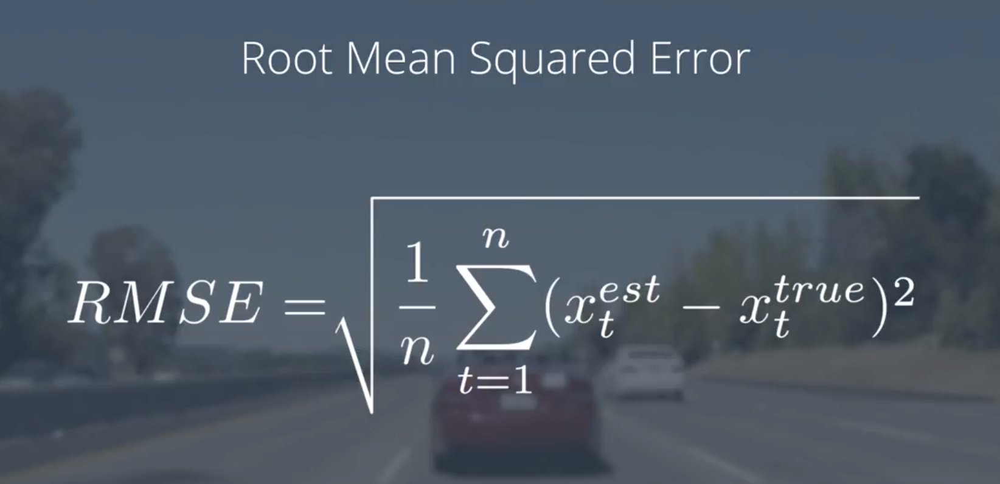
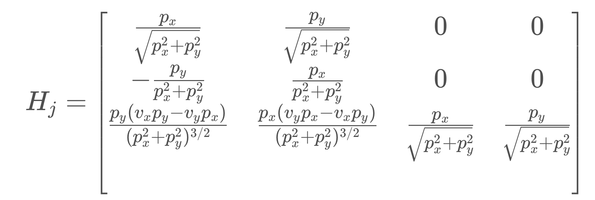
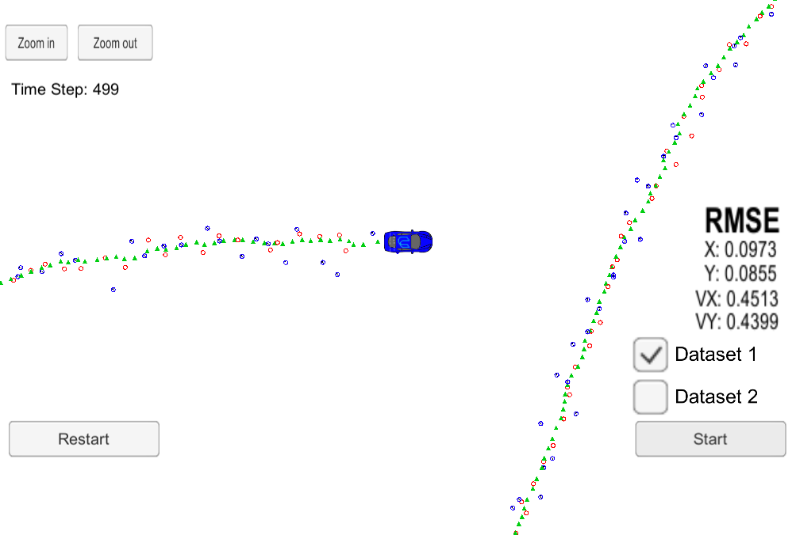

# Extended Kalman Filter Project
Self-Driving Car Engineer Nanodegree Program

In this project a kalman filter wil be utilized to estimate the state of a moving object of interest with noisy lidar and radar measurements. The objective will be to properly estimate the xy position as well as speed of the object while staying below the required root mean square value.

The following describes the steps taken to implemented the kalman filter and a results section will describe if the objectives have been achieved.

## FusionEKF

The `FusionEKF` class is an extended Kalman filter (EKF) class. The EKF takes in data from radar and laser measurements and fuses the data together to form a state prediction and update the states based on sensor measurement data.

The following steps are carried out to finish implementing `FusionEKF`.

### 1. Initialize Variables and Matrices

First the matrices within `FusionEKF.cpp` are initalized. This can be found within lines 35-52 within the `FusionEKF.cpp` file. The process covariance matrix `efk.P_` and the state transition matrix `efk.F_` are defined by 4x4 matrices. The laser measurement matrix `H_laser_` is defined by a 2x4 matrix.

```cpp
  // initializing matrices
  R_laser_ = MatrixXd(2, 2);
  R_radar_ = MatrixXd(3, 3);
  H_laser_ = MatrixXd(2, 4);
  Hj_ = MatrixXd(3, 4);

  //measurement covariance matrix - laser
  R_laser_ << 0.0225, 0,
              0, 0.0225;

  //measurement covariance matrix - radar
  R_radar_ << 0.09, 0, 0,
              0, 0.0009, 0,
              0, 0, 0.09;

  /**
   * Finish initializing the FusionEKF.
   *  Set the process and measurement noises
   */
  ekf_.P_ = MatrixXd(4, 4);
  ekf_.P_ << 1, 0, 0, 0,
             0, 1, 0, 0,
             0, 0, 1000, 0,
             0, 0, 0, 1000;

  ekf_.F_ = MatrixXd(4, 4);
  ekf_.F_ << 1, 0, 1, 0,
             0, 1, 0, 1,
             0, 0, 1, 0,
             0, 0, 0, 1;

  H_laser_ << 1, 0, 0, 0,
              0, 1, 0, 0;
```
### 2. Initialize with First Sensor Measurements

The states are initialized with the first measurement data. If the first data is radar data, it will be converted from polar coordinates to cartesian coordinates by using trigonometry. Radar measurements are taken in polar coordinates. The code can be found in lines 65-107 in the `FusionEKF.cpp` file.

```cpp
if (!is_initialized_) {
  /**
   * Initialize the state ekf_.x_ with the first measurement.
   * Create the covariance matrix.
   * Convert radar from polar to cartesian coordinates.
   */

previous_timestamp_ = measurement_pack.timestamp_;

  // first measurement
  cout << "EKF: " << endl;
  ekf_.x_ = VectorXd(4);
  ekf_.x_ << 1, 1, 1, 1;

  if (measurement_pack.sensor_type_ == MeasurementPackage::RADAR) {
    //  Convert radar from polar to cartesian coordinates and initialize state.
    // set the state with the initial location and zero velocity
    float r = measurement_pack.raw_measurements_[0];
    float theta = measurement_pack.raw_measurements_[1];

    float x = r*cos(theta);
    float y = r*sin(theta);

    ekf_.x_ << x,
               y,
               0,
               0;
  }
  else if (measurement_pack.sensor_type_ == MeasurementPackage::LASER) {
    // Initialize state.

  // set the state with the initial location and zero velocity
  ekf_.x_ << measurement_pack.raw_measurements_[0],
             measurement_pack.raw_measurements_[1],
             0,
             0;
  }

  // done initializing, no need to predict or update
  is_initialized_ = true;
  return;
}
```

### 3. Predict and Update Steps
Once the Kalman filter is initialized, the next iterations of the for loop will call the `ProcessMeasurement()` function to carry out the prediction and update steps.

The update step will determine if the measurement data is radar or laser and subsequently call the appropriate update function. The process covariance matrix is also updated. The code can be found from lines 109-165 in the `FusionEKF.cpp` file.

```cpp
/**
   * Prediction
   */

  /**
   * Update the state transition matrix F according to the new elapsed time.
   * Time is measured in seconds.
   * Update the process noise covariance matrix.
   * Use noise_ax = 9 and noise_ay = 9 for your Q matrix.
   */

  float noise_ax = 9;
  float noise_ay = 9;

  // compute the time elapsed between the current and previous measurements
  // dt - expressed in seconds
  float dt = (measurement_pack.timestamp_ - previous_timestamp_) / 1000000.0;
  previous_timestamp_ = measurement_pack.timestamp_;

  ekf_.F_(0, 2) = dt;
  ekf_.F_(1, 3) = dt;

  float Q_11 = pow(dt,4)/4*noise_ax;
  float Q_31 = pow(dt,3)/2*noise_ax;
  float Q_22 = pow(dt,4)/4*noise_ay;
  float Q_24 = pow(dt,3)/2*noise_ay;
  float Q_13 = pow(dt,3)/2*noise_ax;
  float Q_33 = pow(dt,2)*noise_ax;
  float Q_42 = pow(dt,3)/2*noise_ay;
  float Q_44 = pow(dt,2)*noise_ay;

  ekf_.Q_ = MatrixXd(4, 4);
  ekf_.Q_ << Q_11, 0,    Q_13, 0,
            0,    Q_22, 0,    Q_24,
            Q_31, 0,    Q_33, 0,
            0,    Q_42, 0,    Q_44;

  ekf_.Predict();

  /**
   * Kalman Filter Update
   * - Use the sensor type to perform the update step.
   * - Update the state and covariance matrices.
   */

	if (measurement_pack.sensor_type_ == MeasurementPackage::RADAR) {
		// Radar updates
		ekf_.H_ = tools.CalculateJacobian(ekf_.x_);
		ekf_.R_ = R_radar_;
		ekf_.UpdateEKF(measurement_pack.raw_measurements_);
	} else {
		// Laser updates
		ekf_.H_ = H_laser_;
		ekf_.R_ = R_laser_;
		ekf_.Update(measurement_pack.raw_measurements_);

	}
```

## Kalman Filter Class

The `KalmanFilter` class contains the functions for the prediction step as well as the update steps for the lidar and radar sensor data.

The following code is implemented and can be found in the `kalman_filter.cpp` file frome lines 26-90. Lidar data will use the basic Kalman filter equations and will use `Update` function whereas radar data needs to be linearized with the Jacobian matrix and will use the `UpdateEKF` function.

```cpp
void KalmanFilter::Predict() {
	// Predict the state
    x_ = F_ * x_;
    MatrixXd Ft = F_.transpose();
    P_ = F_*P_*Ft + Q_;
}

void KalmanFilter::Update(const VectorXd &z) {
	// Update the state by using Kalman Filter equations

    VectorXd z_pred = H_ * x_;
    VectorXd y = z - z_pred;
    MatrixXd Ht = H_.transpose();
    MatrixXd S = H_ * P_ * Ht + R_;
    MatrixXd Si = S.inverse();
    MatrixXd PHt = P_ * Ht;
    MatrixXd K = PHt * Si;

    //new estimate
    x_ = x_ + (K * y);
    long x_size = x_.size();
    MatrixXd I = MatrixXd::Identity(x_size, x_size);
    P_ = (I - K * H_) * P_;
}

void KalmanFilter::UpdateEKF(const VectorXd &z) {
	/**
	 * update the state by using Extended Kalman Filter equations
	*/
	double px = x_(0);
	double py = x_(1);
	double vx = x_(2);
	double vy = x_(3);

	// transform polar coordinates to Cartesian coordinates
	double rho = sqrt(px*px + py*py);
	double theta = atan2(py, px);
	double rho_dot = (px*vx + py*vy) / rho;
	VectorXd h = VectorXd(3);

	h << rho, theta, rho_dot;

	VectorXd y = z - h;

	// transform the phi angle to between -pi and pi
	while ( y(1) > M_PI || y(1) < -M_PI ) {
		if ( y(1) > M_PI ) {
		  y(1) -= M_PI;
		} else {
		  y(1) += M_PI;
		}
	}

    VectorXd z_pred = H_ * x_;
    MatrixXd Ht = H_.transpose();
    MatrixXd S = H_ * P_ * Ht + R_;
    MatrixXd Si = S.inverse();
    MatrixXd PHt = P_ * Ht;
    MatrixXd K = PHt * Si;

    //new estimate
    x_ = x_ + (K * y);
    long x_size = x_.size();
    MatrixXd I = MatrixXd::Identity(x_size, x_size);
    P_ = (I - K * H_) * P_;
}
```


## Tools
The tools class will have two helper functions to calculate the root mean squared error and as well as the Jacobian matrix. The Jacobian matrix is used for the linear approximation of the non-linear function `h` which maps the state vector into polar coordinates.

The root mean squred error calcuation can be seen in the image below. The kalman filter estimated value will be subtracted against the ground truth to calculate the error.



The following pictures describes the Jacobian matrix. The matrix consists of values calculated using the cartesian coordinate states.




The following code snippets describe the code implementation of the rmse and the Jacobian within the `tools.cpp` file. It can be found from lines 15-88.

```cpp
VectorXd Tools::CalculateRMSE(const vector<VectorXd> &estimations,
                              const vector<VectorXd> &ground_truth) {
  /**
   *  Calculate the RMSE here.
   */

	VectorXd rmse(4);
	rmse << 0,0,0,0;

	// check the validity of the following inputs:
	//  * the estimation vector size should not be zero
	//  * the estimation vector size should equal ground truth vector size
	if (estimations.size() == 0 || ground_truth.size() == 0 || estimations.size() != ground_truth.size()){
		cout << "Error: Estimations Size Wrong or Ground Truth Size Wrong" << endl;
	}

	// Accumulate squared residuals
	for (int i=0; i < estimations.size(); ++i) {
		VectorXd residual= estimations[i] - ground_truth[i];
		residual = residual.array().pow(2);
		rmse += residual;
	}

	// Calculate the mean
	rmse = rmse / estimations.size();

	// Calculate the squared root
	rmse = rmse.array().sqrt();


	// return the result
	return rmse;


}

MatrixXd Tools::CalculateJacobian(const VectorXd& x_state) {
	MatrixXd Hj(3,4);
	Hj << 0, 0, 0, 0,
	      0, 0, 0, 0,
	      0, 0, 0, 0;

	// recover state parameters
	float px = x_state(0);
	float py = x_state(1);
	float vx = x_state(2);
	float vy = x_state(3);

//	// check division by zero
	if (fabs(px*px + py+py) < 0.0001) {
	    cout << "CalculateJacobian () - Error - Division by Zero" << endl;
	    return Hj;
	} else {
		// compute the Jacobian matrix
		float Hj_00 = px / sqrt(px*px + py*py);
		float Hj_01 = py / sqrt(px*px + py*py);
		float Hj_02 = 0;
		float Hj_03 = 0;
		float Hj_10 = -py / (px*px + py*py);
		float Hj_11 = px / (px*px + py*py);
		float Hj_12 = 0;
		float Hj_13 = 0;
		float Hj_20 = py * (vx*py - vy*px) / pow(px*px+py*py, 1.5);
		float Hj_21 = px * (vy*px - vx*py) / pow(px*px+py*py, 1.5);
		float Hj_22 = px / sqrt(px*px + py*py);
		float Hj_23 = py / sqrt(px*px + py*py);

	Hj << Hj_00, Hj_01, Hj_02, Hj_03,
		  Hj_10, Hj_11, Hj_12, Hj_13,
		  Hj_20, Hj_21, Hj_22, Hj_23;

	}

	return Hj;
}
```

# Results

The resulting implementation is able to track the object of interest (a vehicle) and stay within the required rmse values of rmse <= [.11, .11, 0.52, 0.52]. Both datasets were verified to satisfy the rmse requirements.




---
